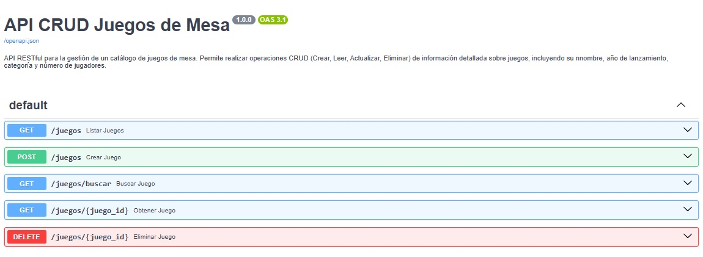
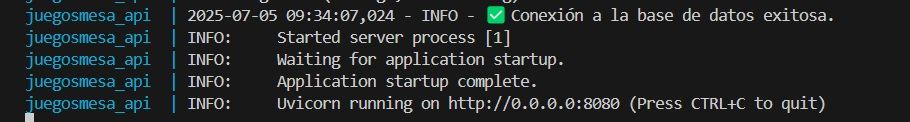
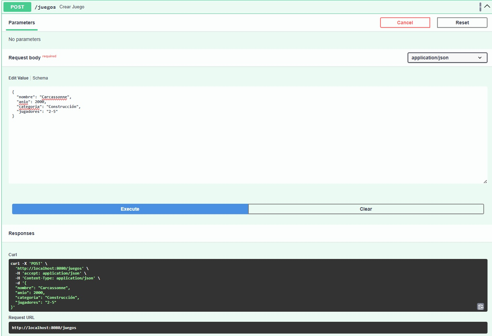
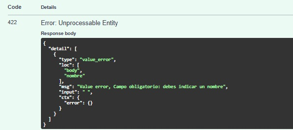
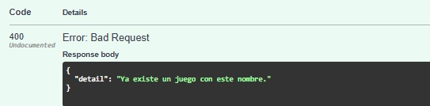
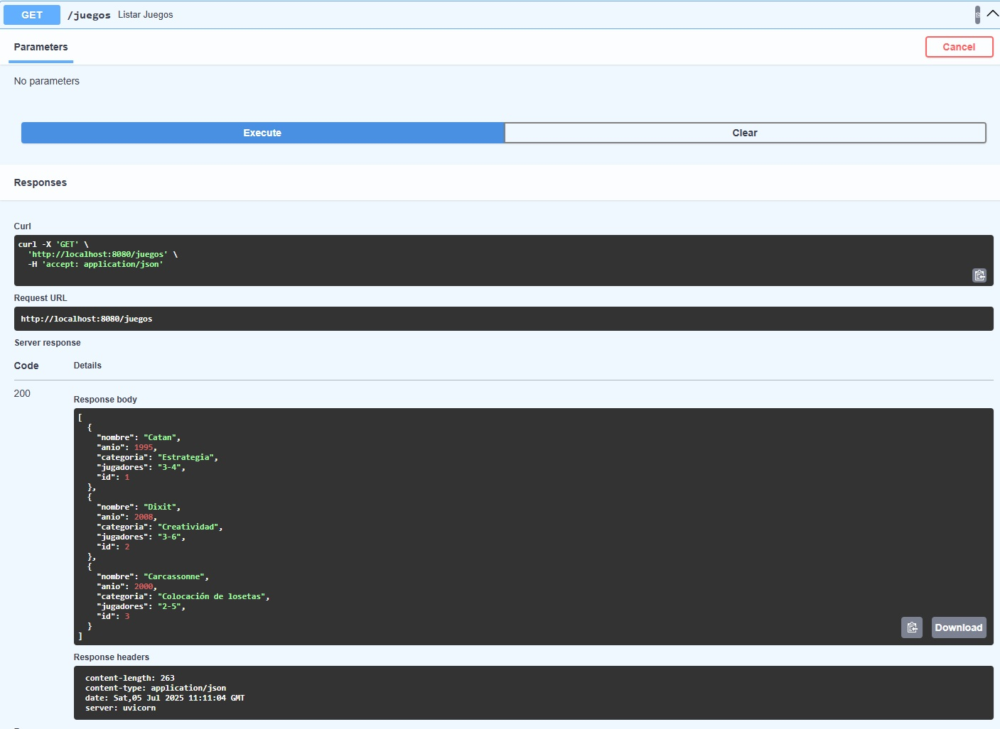
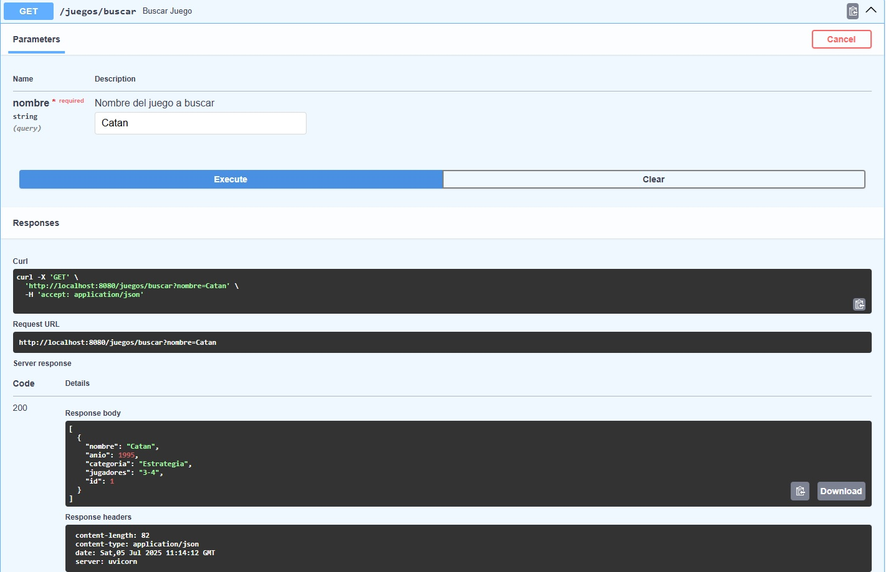
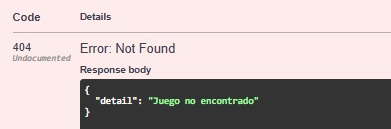
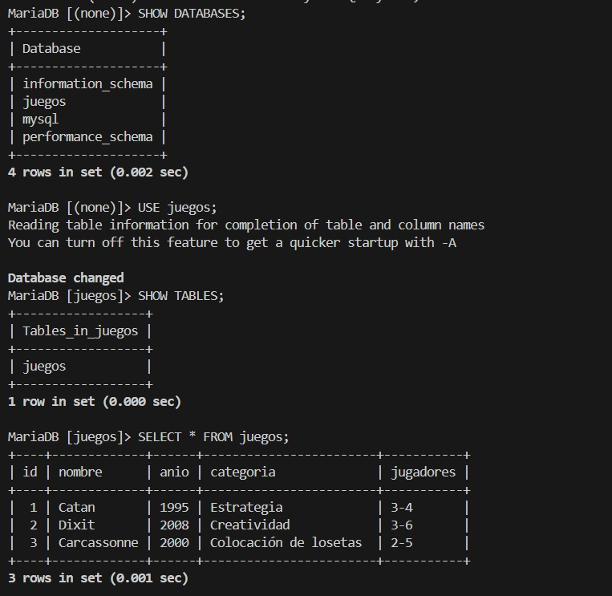

# 🎲 API CRUD Juegos de Mesa

Proyecto realizado con **FastAPI**, **MariaDB** y **Docker Compose**. Esta API permite gestionar un catálogo de juegos de mesa con operaciones CRUD (crear, obtener, eliminar, etc.), incorporando robustez, configurabilidad y mejores prácticas de desarrollo y despliegue.

## 📦 Tecnologías Usadas

- Python 3.10 (imagen `slim` optimizada)
- FastAPI
- SQLAlchemy
- MariaDB 10.5 
- Docker / Docker Compose
- Uvicorn
- PyMySQL

---

## 🧠 ¿Qué Hace Esta API?

- Permite registrar nuevos juegos de mesa con nombre, año, categoría y número de jugadores, incluyendo **validación de entrada estricta** para asegurar la calidad de los datos (min_length, validación de espacios vacíos, etc.).
- Permite listar todos los juegos registrados.
- Permite obtener un juego por su `id`.
- Permite buscar por nombre de juego (GET con query param).
- Permite eliminar juegos por `id`.
- Implementa **control de errores HTTP**, devolviendo `HTTP 404 Not Found` para recursos no encontrados y `HTTP 400 Bad Request` para datos de entrada inválidos.
- Incluye una lógica de **reintento de conexión a la base de datos** configurable al inicio de la aplicación, mejorando su resiliencia.
- Incorpora un **sistema de logging avanzado** para la trazabilidad de la aplicación, incluyendo logs de conexión a la base de datos y un middleware HTTP personalizado para registrar todas las peticiones y respuestas.
- Es **completamente configurable** mediante variables de entorno definidas directamente en `docker-compose.yml` facilitando su despliegue.

---

## 🛠 Estructura del Proyecto

```text
JuegosMesa_API/
├── app/                  # Código fuente de la API
│   ├── __init__.py
│   ├── crud.py           # Lógica CRUD (crear, leer, actualizar, eliminar)
│   ├── database.py       # Configuración de conexión a la base de datos (MariaDB o SQLite)
│   ├── main.py           # Entrypoint de la API, configuración de logging, middleware y endpoints
│   ├── models.py         # Definición del modelo ORM (Juego)
│   └── schemas.py        # Esquemas de datos Pydantic (con validaciones reforzadas)
├── .dockerignore         # Archivo para ignorar en la construcción de la imagen Docker
├── .gitignore            # Archivo para ignorar en el control de versiones de Git
├── docker-compose.yml    # Orquestación de servicios (API y Base de Datos)
├── Dockerfile            # Imagen personalizada y optimizada para la aplicación FastAPI
├── mejoras.md            # Documento explicando las mejoras implementadas
├── README.md             # Este documento
├── requirements.txt      # Dependencias de Python
└── venv/                 # Entorno virtual de Python (ignorados por Git y Docker)
```

El proyecto utiliza un archivo docker-compose.yml que orquesta dos contenedores principales:

- **juegomesa-api**: contenedor que ejecuta la API desarrollada en FastAPI. La imagen de este contenedor se construye automáticamente al ejecutar `docker-compose up --build`.
- **juegos-db**: contenedor de base de datos `MariaDB`.

Ambos contenedores comparten la red `juegosmesa_api_juegos-net`(definida en `docker-compose.yml`), por lo que la API puede resolver la base de datos simplemente usando el nombre de servicio `db` como host. Además, el contenedor `juegos-db` utiliza un volumen persistente (`juegosmesa_api_juegos-data`) para asegurar que los datos de la base de datos no se pierdan. El servicio `juegomesa-api` tiene una dependencia del `healthcheck` de `juegos-db` para asegurar un inicio correcto.

---

## 🚀 Cómo ejecutar el proyecto

1. **Clonar el Repositorio**:

```bash
   git clone https://github.com/anabbre/JuegosdeMesa_API
   cd JuegosMesa_API
   ```

2. **Levanta los contenedores (Entorno de Desarrollo)**:

Para construir las imágenes y levantar la API junto con la base de datos, ejecuta el siguiente comando en la raíz del proyecto:

   ```bash
   docker compose up --build
   ```

Verás en la terminal la salida de los contenedores MariaDB y FastAPI, indicando su inicialización y conexión:

3. **Accede a la documentación automática de la API**:

Una vez que los contenedores estén corriendo, puedes acceder a la documentación interactiva de la API:

   - Swagger UI: http://localhost:8080/docs
   - Redoc: http://localhost:8080/redoc

4. **Accede al contenedor de base de datos y consulta (opcional)**:

Para interactuar directamente con la base de datos MariaDB dentro de su contenedor:

   ```bash
   docker exec -it juegos-db bash
   mariadb -u root -p #Te pedirá la contraseña definida en docker-compose.yml (MYSQL_ROOT_PASSWORD)
   USE juegos;
   USE juegos;
   SELECT * FROM juegos;
   ```

---

## 📂 Endpoints disponibles

| Método | Ruta           | Descripción | Código Éxito | Códigos Error Posibles |
| :----- | :--------------------------- | :-------------------------------- | :----------- | :---------------------- |
| POST   | `/juegos`      | Crear un nuevo juego | `201 Created` | `400 Bad Request`, `422 Unprocessable Entity` |
| GET    | `/juegos`      | Obtener todos los juegos | `200 OK` | - |
| GET    | `/juegos/{id}` | Obtener juego por `id` | `200 OK` | `404 Not Found` |
| GET    | `/juegos/buscar?nombre=<str>` | Buscar juegos por nombre (parcial) | `200 OK` | `404 Not Found` (si no hay coincidencias) |
| DELETE | `/juegos/{id}` | Eliminar juego por `id` | `200 OK` | `404 Not Found` |

---

## 📊 Ejemplos Visuales y Pruebas Detalladas

La API proporciona una interfaz interactiva de Swagger UI (`http://localhost:8080/docs`) para probar todos los endpoints y visualizar su comportamiento, incluyendo la gestión de errores.


### 🚀 Arranque y Logging de la API
Al iniciar los servicios con Docker Compose, la API muestra en sus logs la confirmación de la conexión exitosa a la base de datos MariaDB y el inicio del servidor Uvicorn. Esto demuestra la robustez de la conexión y la disponibilidad de la API.



### ✅ Creación Exitosa de un Juego (POST /juegos)
La documentación interactiva de Swagger UI permite probar fácilmente el endpoint `POST /juegos`. Al enviar un JSON con los datos de un nuevo juego, la API lo registra correctamente en la base de datos y responde con el código de estado `201 Created`.
* **Ejemplo de JSON para registrar un juego:**
    ```json
    {
      "nombre": "Dixit",
      "anio": 2008,
      "categoria": "Creatividad",
      "jugadores": "3-6"
    }
    ```
* **Respuesta esperada:** `201 Created` con el objeto del juego recién creado.
   

### ❌ Manejo de Errores al Crear Juegos

La API implementa una robusta validación de entrada y manejo de errores para el endpoint `POST /juegos`.
* **Validación de Datos (422 Unprocessable Entity):**
    Un intento de crear un juego con campos obligatorios vacíos o inválidos (ej., `min_length=1` o campos con solo espacios en blanco) resultará en un error HTTP `422 Unprocessable Entity`, indicando los problemas de validación específicos.
    ```json
    {
      "nombre": "",
      "anio": 2023,
      "categoria": "",
      "jugadores": ""
    }
    ```
    * **Respuesta esperada:** `422 Unprocessable Entity`.

    

* **Nombre de Juego Duplicado (400 Bad Request):**
    Si se intenta crear un juego con un `nombre` que ya existe en la base de datos (debido a la restricción de unicidad), la API devolverá un `400 Bad Request` con un mensaje descriptivo.

    * **Respuesta esperada:** `400 Bad Request` con detalle "Ya existe un juego con este nombre.".

    

### 🔄 Búsqueda y Recuperación de Juegos

* **Listar Todos los Juegos (GET /juegos):**
    El endpoint `GET /juegos` permite obtener un listado completo de todos los juegos de mesa registrados en el sistema.

   

* **Buscar Juego por Nombre (GET /juegos/buscar?nombre=<str>):**
    El endpoint `GET /juegos/buscar` con un parámetro de consulta (`nombre=...`) permite filtrar el catálogo de juegos. En el ejemplo, al buscar "Catan", solo se retorna el juego que coincide. Si no se encuentran coincidencias, la API devolverá un `404 Not Found`.

   

### 🗑 Eliminación de Juegos y Errores de Recurso No Encontrado

* **Eliminar Juego por ID (DELETE /juegos/{id}):**
    Permite eliminar un juego específico por su identificador único.

* **Recurso No Encontrado (404 Not Found - GET /juegos/{id} o DELETE /juegos/{id}):**
    Al intentar obtener o eliminar un juego con un `id` que no existe en la base de datos, la API responderá con un `404 Not Found`.

   
---

### 🩺 Health-check de MariaDB en Producción
La configuración de Docker Compose incluye un `healthcheck` robusto para la base de datos MariaDB. Esto asegura que el servicio de la API solo se inicie una vez que la base de datos esté completamente operativa y saludable. El comando `docker compose ps` refleja este estado.


### 📂 Verificación Directa de Registros en MariaDB
Para confirmar la persistencia y correcta inserción de los datos, es posible acceder directamente a la consola del contenedor de MariaDB y realizar consultas SQL, como se muestra a continuación.


---


## 👤 Autoría
- Ana Belén Ballesteros 
- LinkedIn: www.linkedin.com/in/ana-belén-ballesteros-redondo
