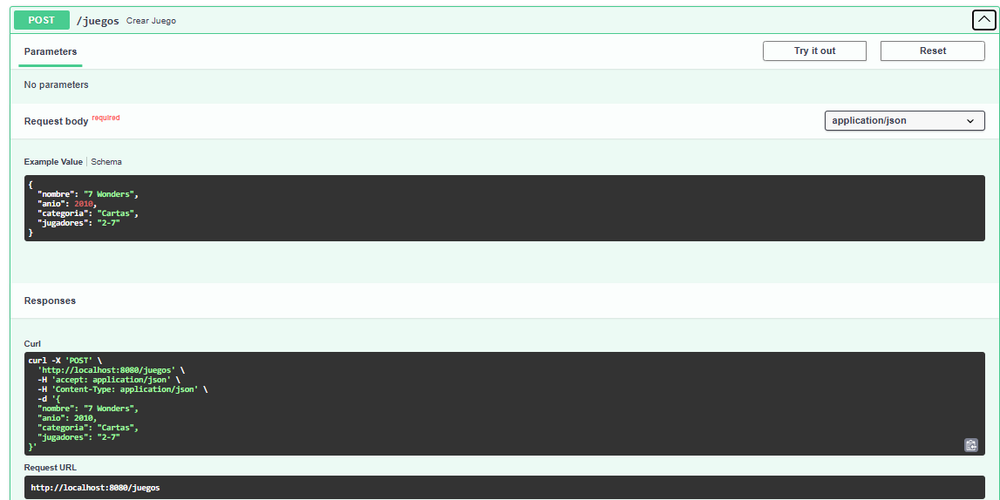
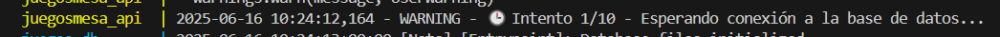
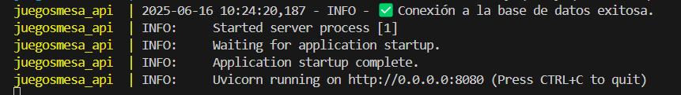
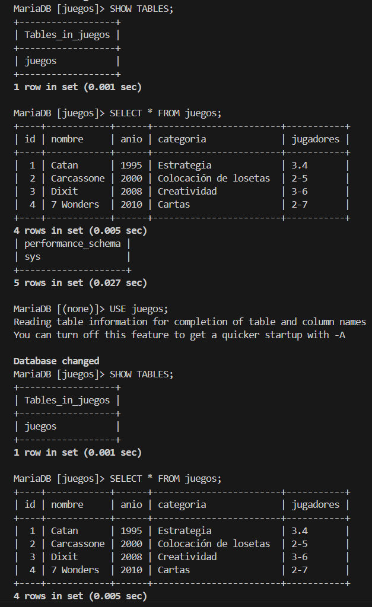

# 🎲 API CRUD Juegos de Mesa

Proyecto realizado con **FastAPI**, **MariaDB** y **Docker Compose**. Esta API permite gestionar un catálogo de juegos de mesa con operaciones CRUD (crear, obtener, eliminar, etc.).

## 📦 Tecnologías usadas

- Python 3.10
- FastAPI
- SQLAlchemy
- MariaDB 10.6
- Docker / Docker Compose
- Uvicorn
- PyMySQL

---

## 🧠 ¿Qué hace esta API?

- Permite registrar nuevos juegos de mesa con nombre, año, categoría y número de jugadores.
- Permite listar todos los juegos registrados.
- Permite obtener un juego por su `id`.
- Permite buscar por nombre de juego (GET con query param).
- Permite eliminar juegos por `id`.
- Incluye una lógica de reintento de conexión a la base de datos si aún no está disponible.
- Incluye trazabilidad básica con logging para registrar los intentos de conexión.

---

## 🛠 Estructura del proyecto
📁 JuegosMesa_API/
│
├── app/
│ ├── main.py # Entrypoint de la API
│ ├── crud.py # Lógica CRUD
│ ├── database.py # Configuración de conexión a MariaDB
│ ├── models.py # Modelo SQLAlchemy
│ └── schemas.py # Validación con Pydantic
│
├── Dockerfile # Imagen personalizada para FastAPI
├── docker-compose.yml # Orquestación de servicios y red entre contenedores
├── requirements.txt # Dependencias
└── README.md # Este documento

Además, `docker-compose.yml` crea y orquesta **dos contenedores**:

- `juegosmesa_api`: contenedor que ejecuta la API desarrollada en FastAPI.
- `juegos-db`: contenedor de base de datos MariaDB.

Ambos contenedores están conectados en una **misma red personalizada** definida en `docker-compose.yml`, lo que les permite comunicarse directamente usando su nombre de servicio (`juegos-db`). Esto cumple con el requisito del enunciado de que ambos contenedores deben coexistir en la misma red y comunicarse por nombre.


---

## 🚀 Cómo ejecutar el proyecto

1. Clona el repositorio:

```
git clone https://github.com/anabbre/JuegosdeMesa_API.git
cd JuegosMesa_API
```

2. Levanta los contenedores:

```
docker-compose up --build
```

3. Accede a la documentación automática de la API:

Swagger UI: http://localhost:8080/docs`

4. Accede al contenedor de base de datos y consulta
```
docker exec -it juegos-db bash
mariadb -u root

USE juegos;
SELECT * FROM juegos;
```
---

## 📂 Endpoints disponibles

| Método | Ruta           | Descripción                     |
| ------ | -------------- | ------------------------------- |
| POST   | `/juegos`      | Crear un nuevo juego            |
| GET    | `/juegos`      | Obtener todos los juegos        |
| GET    | `/juegos/{id}` | Obtener juego por `id`          |
| GET    | `/buscar`      | Buscar por nombre (query param) |
| DELETE | `/juegos/{id}` | Eliminar juego por `id`         |

---

## 🧪 Pruebas en Swagger
Ejemplo de JSON para registrar un juego:
```
{
  "nombre": "Dixit",
  "anio": 2008,
  "categoria": "Creatividad",
  "jugadores": "3-6"
}
```

---

## 🐳 Acceder a la base de datos MariaDB desde el contenedor

1. Entra al contenedor:
```
docker exec -it juegos-db bash
```

2. Inicia sesión como root:
```
mariadb -u root
```

3. Usa la base de datos y consulta:
```
USE juegos;
SELECT * FROM juegos;
```


---

## 📊 Ejemplos visuales 

#### ✅ Crear juego desde Swagger UI
A través de Swagger UI es posible registrar un juego enviando un JSON


#### 🔁 Reintento de conexión a MariaDB con logging
La API espera a que el contenedor de base de datos esté listo antes de iniciar completamente.
A continuación se muestra un ejemplo de cómo se registran los intentos en la terminal:




#### 📂 Verificación directa en la base de datos
Una vez registrados los juegos, pueden verse directamente desde la consola del contenedor MariaDB:


---

## 👤 Autoría
- Ana Belén Ballesteros 
- LinkedIn: www.linkedin.com/in/ana-belén-ballesteros-redondo
